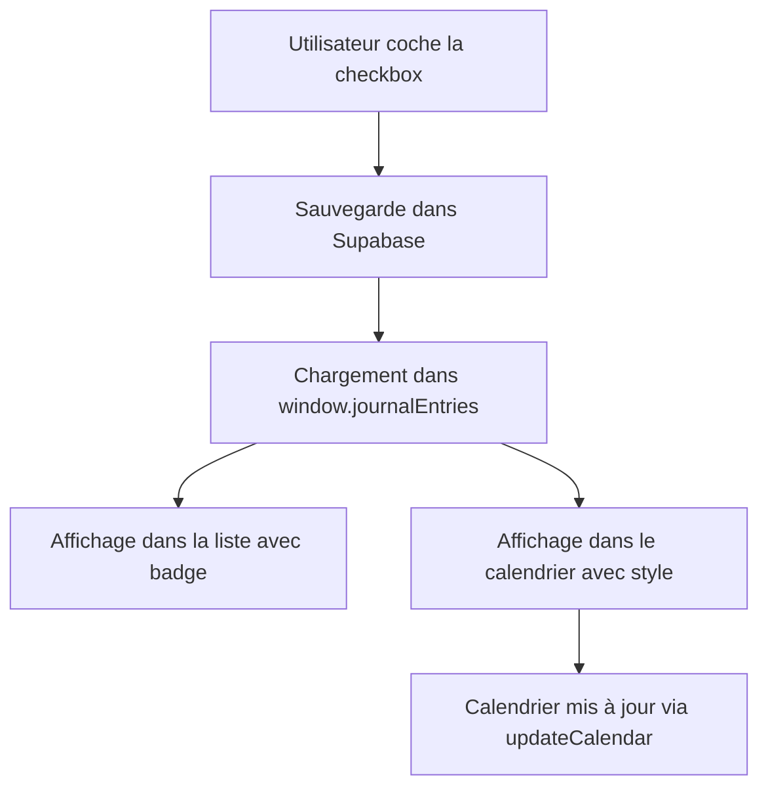

# Fonctionnalité "Pas de trade aujourd'hui"

## 📋 Description

Cette fonctionnalité permet aux utilisateurs de marquer les jours où ils n'ont **volontairement** pas tradé pour une raison stratégique (marché non propice, conditions inadaptées, etc.). Ces jours sont ensuite affichés dans le calendrier avec un style distinct.

## 🎯 Objectifs

1. **Visibilité** : Distinguer les jours sans trade pour raison stratégique des jours sans activité
2. **Analyse** : Permettre aux utilisateurs de suivre leur discipline et leur capacité à éviter les mauvais marchés
3. **Transparence** : Afficher clairement dans le calendrier les différents types de journées

## ✨ Fonctionnalités

### 1. Ajout de la checkbox dans le formulaire

Lors de l'ajout ou de la modification d'une note dans le **Journal Quotidien**, une nouvelle checkbox est disponible :

```
🚫 Pas de trade aujourd'hui (marché non propice)
```

**Emplacement** : Entre la 2ème image optionnelle et les boutons d'action

**Design** :
- Bordure dorée (#ac862b) cohérente avec la charte graphique
- Texte explicatif en gris sous la checkbox
- Hover effect pour meilleure UX

### 2. Affichage dans la liste des notes

Lorsqu'une note est marquée comme "Pas de trade", un badge est affiché :

```
🚫 Pas de trade
```

**Style** :
- Badge gris avec bordure
- Positionné à côté de la date
- Visible dans la liste des entrées du journal

### 3. Intégration dans le calendrier

Le calendrier affiche maintenant **3 types de jours** différents :

#### Jours avec trades (existant)
- **Fond vert** : P&L positif
- **Fond rouge** : P&L négatif
- Affichage : P&L, nombre de trades, win rate

#### Jours "Pas de trade" (NOUVEAU)
- **Fond gris avec bordure**
- Icône : 🚫
- Texte : "Pas de trade"

#### Jours sans activité (existant)
- **Fond blanc**
- Aucune information affichée

### 4. Édition

Lors de l'édition d'une note existante :
- ✅ La checkbox est pré-remplie selon la valeur sauvegardée
- ✅ La modification met à jour correctement le champ `no_trade`

## 🗄️ Base de données

### Table : `journal_entries`

**Nouvelle colonne ajoutée** :
```sql
no_trade BOOLEAN DEFAULT FALSE
```

**Description** : Indique si l'utilisateur n'a pas tradé ce jour-là pour une raison stratégique.

### Migration SQL

Un script de migration est fourni dans :
```
supabase-migrations/add_no_trade_column.sql
```

**À exécuter dans Supabase SQL Editor** :
```sql
ALTER TABLE journal_entries 
ADD COLUMN IF NOT EXISTS no_trade BOOLEAN DEFAULT FALSE;

UPDATE journal_entries 
SET no_trade = FALSE 
WHERE no_trade IS NULL;
```

## 🔧 Implémentation technique

### Fichiers modifiés

1. **index.html**
   - Ajout de la checkbox dans le modal `addNoteModal` (ligne ~3605)
   - Modification du calendrier pour afficher les jours "no trade" (ligne ~9123)
   - Ajout de l'affichage de l'icône et du texte dans les cellules (ligne ~9169)

2. **supabase-journal.js**
   - Lecture du champ `noTradeToday` depuis le formulaire (ligne ~47)
   - Ajout du champ `no_trade` dans le payload Supabase (ligne ~186)
   - Affichage du badge dans la liste des notes (ligne ~348-352)
   - Pré-remplissage de la checkbox lors de l'édition (ligne ~779-782)

### Workflow



## 📊 Cas d'usage

### Exemple 1 : Marché non propice
```
Date : 2026-04-25
Note : "Marché trop volatil aujourd'hui, pas de setup propre. 
        Préférence pour attendre demain."
☑️ Pas de trade aujourd'hui
```

**Résultat** :
- Badge 🚫 dans la liste des notes
- Cellule grise avec bordure dans le calendrier
- Distinction claire vs jour sans connexion

### Exemple 2 : Conditions inadaptées
```
Date : 2026-04-26
Note : "Spread trop élevé sur ES, volume faible. 
        Aucun setup intéressant détecté."
☑️ Pas de trade aujourd'hui
```

## 🧪 Tests

### Checklist de validation

- [ ] Ajouter une note avec checkbox cochée → Badge apparaît dans la liste
- [ ] Vérifier que le calendrier affiche le jour en gris avec bordure
- [ ] Vérifier que l'icône 🚫 et le texte "Pas de trade" sont visibles
- [ ] Éditer une note existante → Checkbox pré-remplie correctement
- [ ] Décocher la checkbox → Badge et style calendrier disparaissent
- [ ] Ajouter un trade le même jour → Le jour passe en vert/rouge (priorité aux trades)

### Scénarios de test

1. **Ajout d'une note "no trade"**
   - Aller dans Journal Quotidien
   - Cliquer sur "Ajouter une Note"
   - Remplir la date, le texte
   - Cocher "Pas de trade aujourd'hui"
   - Enregistrer
   - Vérifier badge + calendrier

2. **Édition d'une note existante**
   - Cliquer sur ✏️ sur une note
   - Vérifier l'état de la checkbox
   - Modifier et enregistrer
   - Vérifier que les changements sont reflétés

3. **Calendrier multi-états**
   - Créer 3 types de jours :
     - Un jour avec trades (vert/rouge)
     - Un jour "no trade" (gris bordure)
     - Un jour vide (blanc)
   - Vérifier que les 3 styles sont distincts

## 🚀 Déploiement

### Étapes

1. ✅ Code mergé dans la branche `main`
2. ✅ Script SQL à exécuter dans Supabase (voir `supabase-migrations/add_no_trade_column.sql`)
3. ✅ Vercel déploie automatiquement depuis `main`
4. ⏳ Attendre 2-3 minutes pour le déploiement
5. ✅ Tester en production sur https://journal-trader-360.vercel.app

### Post-déploiement

- [ ] Exécuter le script SQL dans Supabase
- [ ] Tester l'ajout d'une note avec checkbox
- [ ] Vérifier l'affichage dans le calendrier
- [ ] Informer les utilisateurs de la nouvelle fonctionnalité

## 📚 Documentation utilisateur

### Guide utilisateur (à ajouter dans l'aide)

**Comment marquer un jour sans trade ?**

1. Allez dans **Journal Quotidien**
2. Cliquez sur **"Ajouter une Note"**
3. Remplissez vos observations du jour
4. Cochez **"🚫 Pas de trade aujourd'hui (marché non propice)"**
5. Cliquez sur **"Ajouter la Note"**

**Pourquoi utiliser cette fonctionnalité ?**

- Distinguer les jours où vous avez **choisi** de ne pas trader des jours où vous n'étiez simplement pas actif
- Suivre votre **discipline** et votre capacité à éviter les mauvais marchés
- Améliorer votre **analyse** en identifiant les patterns de marché non propices

**Où voir les jours "no trade" ?**

- Dans la liste du **Journal Quotidien** : Badge 🚫 à côté de la date
- Dans le **Calendrier** : Cellules grises avec bordure et icône 🚫

## 🐛 Dépannage

### La checkbox ne s'affiche pas
- Vérifier que le fichier `index.html` est bien à jour
- Rafraîchir la page (Ctrl + F5)
- Vider le cache du navigateur

### Le badge ne s'affiche pas dans la liste
- Vérifier que `supabase-journal.js` est chargé
- Ouvrir la console (F12) et chercher les erreurs
- Vérifier que `window.journalEntries` contient les données

### Le calendrier ne montre pas les jours "no trade"
- Vérifier que `window.journalEntries` est bien rempli
- Ouvrir la console et taper : `console.log(window.journalEntries)`
- Vérifier que le champ `no_trade` existe dans les données
- Vérifier que la fonction `updateCalendar()` est bien appelée

### La colonne no_trade n'existe pas dans Supabase
- Exécuter le script SQL de migration : `supabase-migrations/add_no_trade_column.sql`
- Attendre quelques secondes pour la propagation
- Tester à nouveau

## 📝 Notes techniques

### Compatibilité
- ✅ Le code est rétrocompatible : les entrées existantes auront `no_trade = FALSE` par défaut
- ✅ Si la colonne n'existe pas encore dans Supabase, l'application continue de fonctionner (erreur silencieuse)

### Performance
- Aucun impact sur les performances
- La vérification dans le calendrier utilise `Array.find()` (O(n) par cellule)
- Optimisation possible si nécessaire via un index Map

### Évolutions futures possibles
- [ ] Ajouter des **raisons prédéfinies** (marché non propice, vacances, congé, etc.)
- [ ] Afficher des **statistiques** sur les jours "no trade" (ex: "15 jours évités ce mois")
- [ ] Créer un **rapport mensuel** des jours "no trade" vs jours tradés
- [ ] Intégrer avec la **checklist** : alerte si trade sans checklist ET sans "no trade"

## 🤝 Contribution

Pour toute question ou suggestion d'amélioration, merci de créer une issue sur GitHub.

---

**Version** : 1.0.0  
**Date de création** : 2026-04-26  
**Auteur** : Trader360 Team
